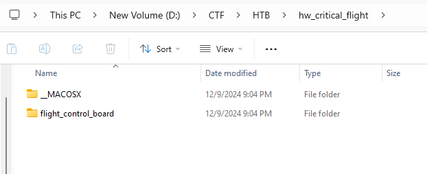
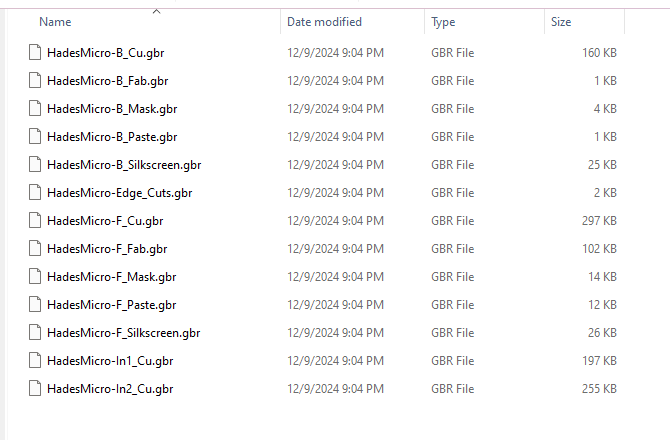
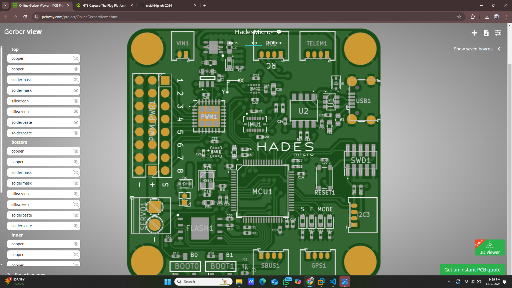
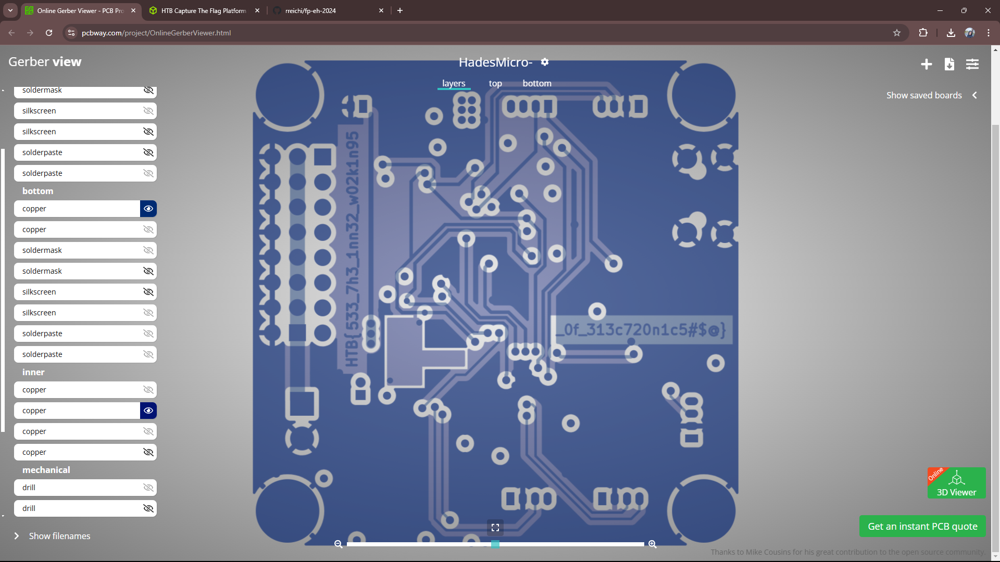
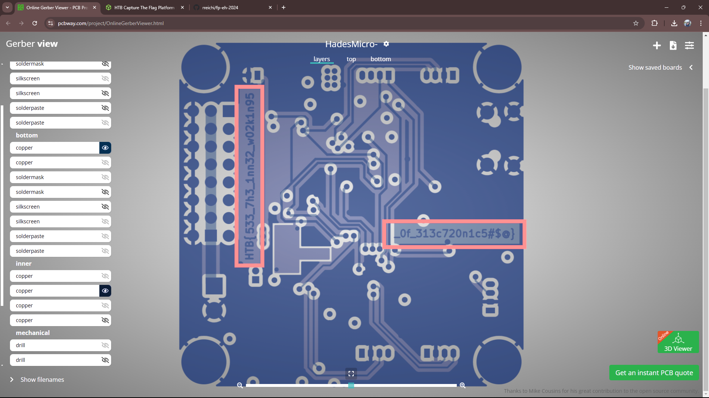

## Hack The Box — Hardware: Critical Flight Writeup

#### Langkah Pengerjaan :
1. Download file yang disertakan pada *challenge*

Setelah download, buka folder **flight_control_board**. Terdapat file dengan format **.gbr** yang merupakan format untuk PCBs (Printed Circuit Board)

2. Kita memerlukan tools untuk menganalisis *circuit board*. Disini saya menggunakan 
- Upload file **.zip** yang didownload tadi lalu akan ditampilkan layout PCB seperti ini

- Pindah ke tab layers lalu hide semua layer kecuali **bottom > copper** dan **inner > copper** 

**Flag : HTB{533_7h3_1nn32_w02k1n95_0f_313c720n1c5#$@}**