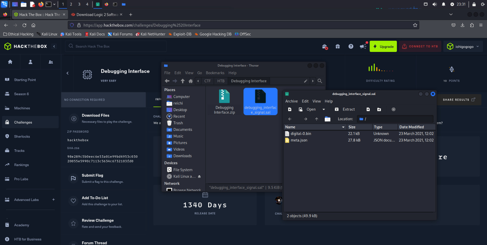
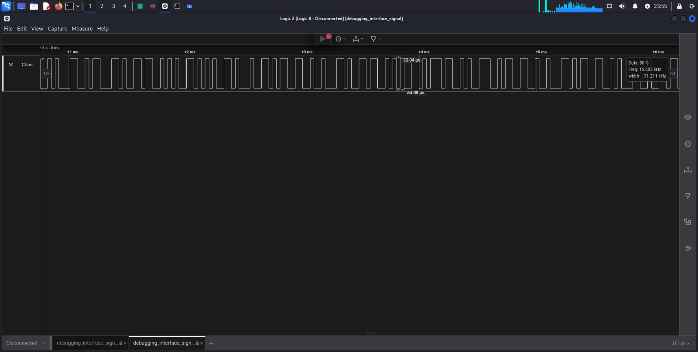
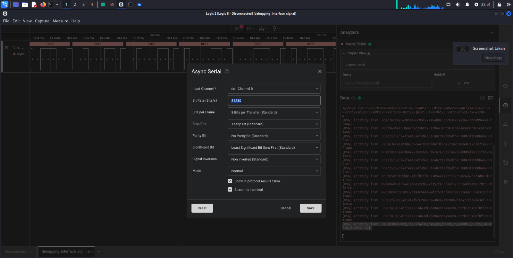
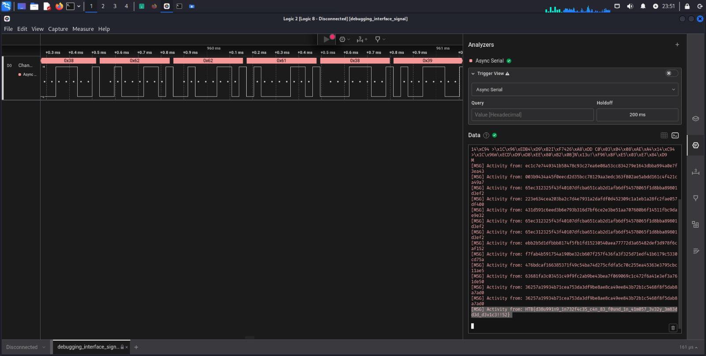

## Hack The Box — Hardware: Debugging Interface Writeup

#### Langkah Pengerjaan :

1. Download dan unzip file **Debugging Interface.zip**, lalu didalamnya akan ada file **debugging_interface_signal.sal**, unzip juga file tersebut

**.sal** merupakan log atau data capture yang menyimpan informasi mengenai data yang ditangkap selama proses analisis

2. Disini saya menggunakan **Saleae** sebagai tool untuk menganalisis sinyal digital

- Untuk mendapatkan *bit rate* pada *async serial* saya menggunakan rumus:
`Bit rate(bits/s) = 1/Bit Time(s)`

- Scroll kebawah dan akan didapati flag seperti berikut:

**Flag: HTB{d38u991n9_1n732f4c35_c4n_83_f0und_1n_41m057_3v32y_3m83dd3d_d3v1c3!!52}**