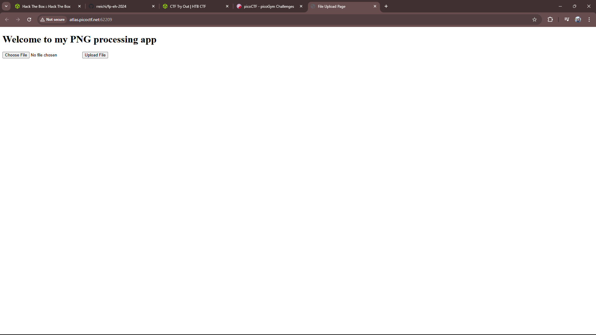
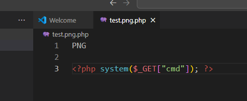
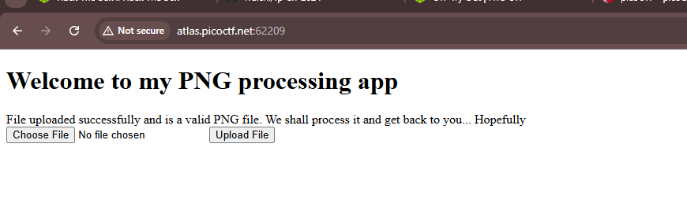
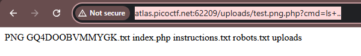
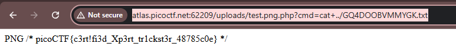

## PicoCTF — Web Exploitation: Trickster Writeup

#### Langkah Pengerjaan :

1. Buka web yang diberikan

2. Buat script yang akan diupload pada web tersebut, saya menggunakan **Visual Studio**

Untuk penamaan file diharuskan **.png** dikarenakan web tersebut hanya bisa memroses file dengan format png saja. Lalu upload

3. Edit endpoint sebagai berikut, lalu gunakan command **ls**

4. Edit lagi tapi gunakan command **cat** untuk menampilkan isi dari file **.txt**

**Flag: picoCTF{c3rt!fi3d_Xp3rt_tr1ckst3r_48785c0e}**